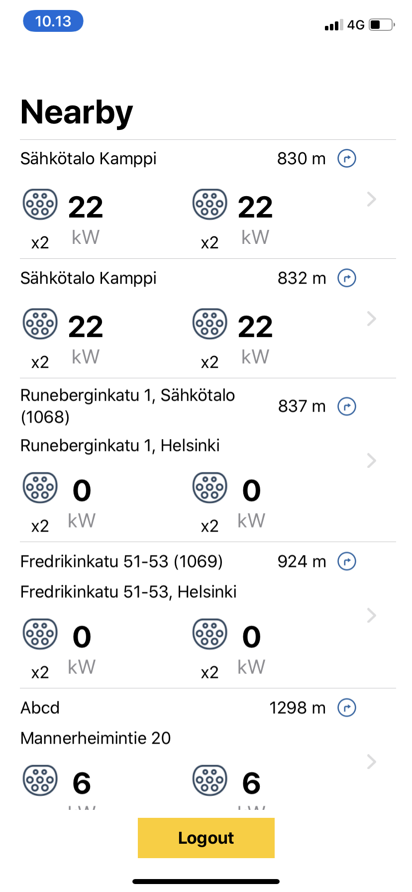
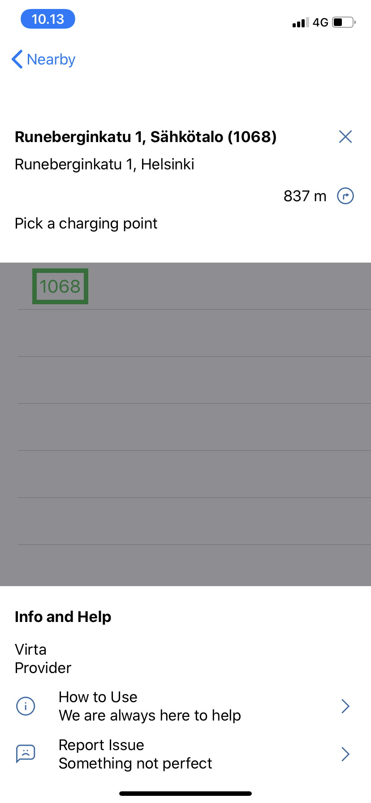

# Virta

A SwiftUI iOS application to list the nearest 10 charging stations near you.

## Setup Instructions

1. Git clone this repo: `git clone https://github.com/ShanavasPS/Virta.git`
2. cd into Virta folder
3. Open `Virta.xcodeproj` in Xcode
4. Run the application

## Features

1. Login 

2. Lists nearest stations orderes by distance to the location, nearest first

3. Shows details of the selected station

4. Navigates to the selected station

## OS Requirements

Version 13.0 and above.

Tested on iPhone XR with iOS version 13.2.2
